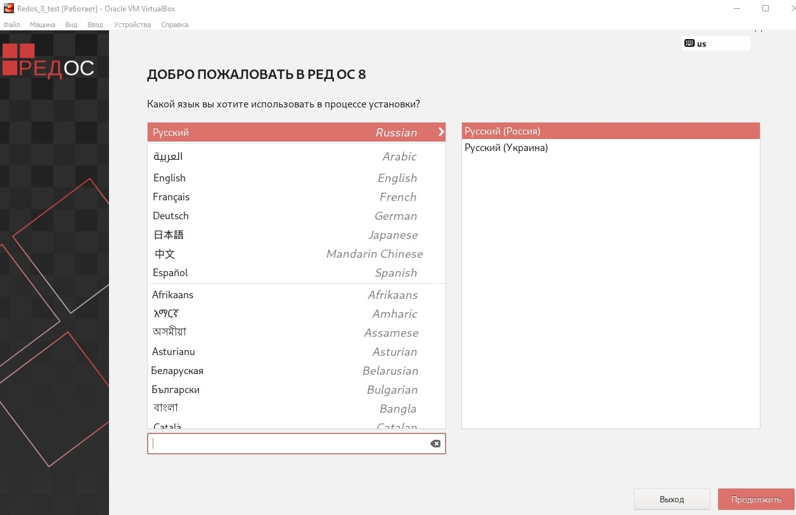
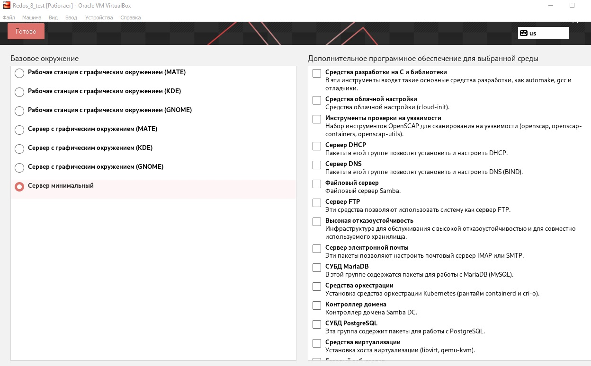
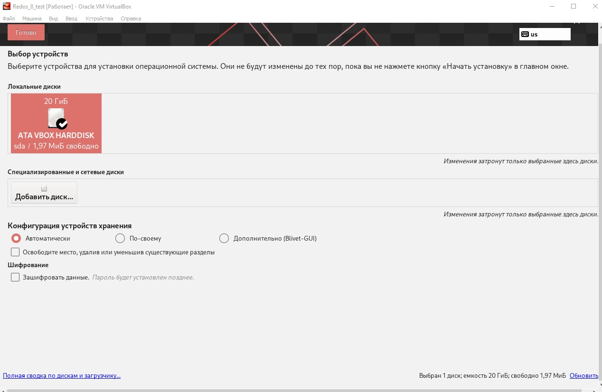
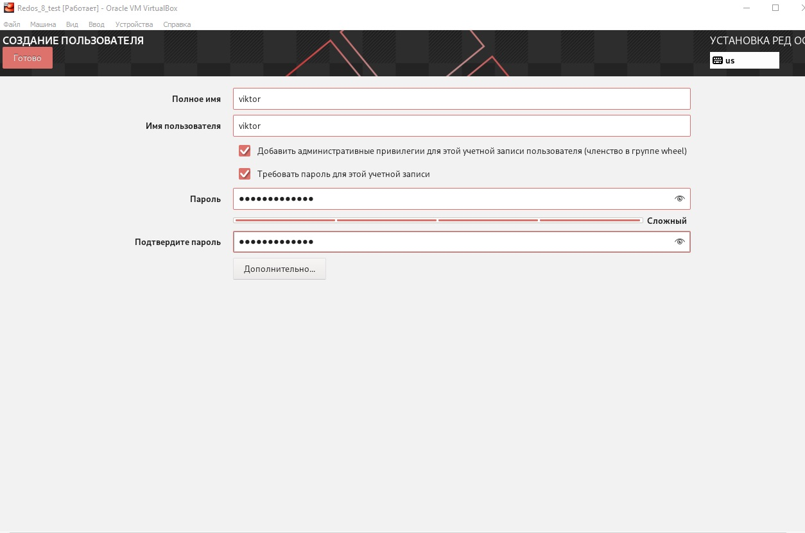
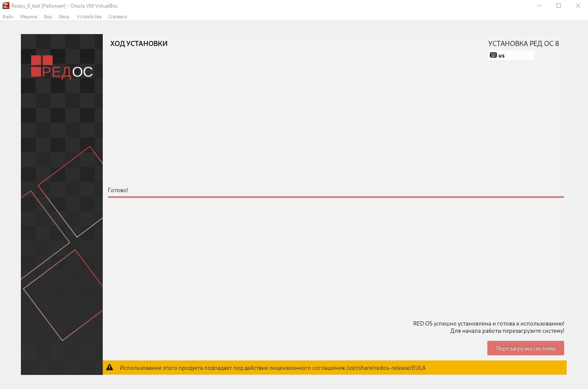
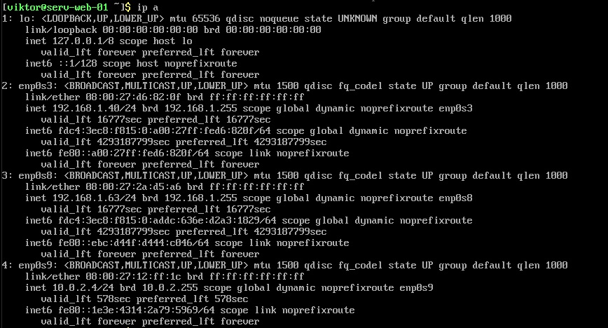
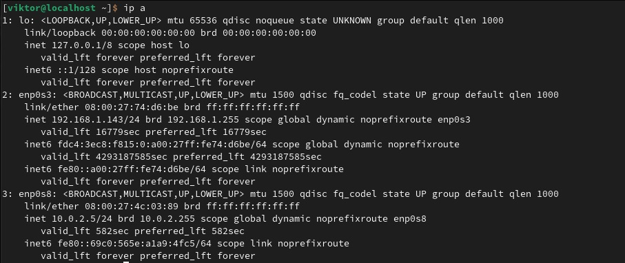
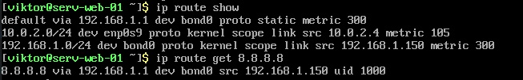
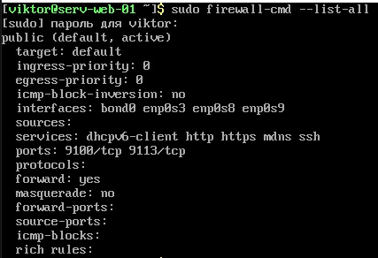
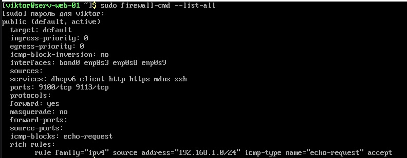

# Тестовое задание (DevOps Engineer)

**Вводные данные:** Есть смонтированный "голый" сервер.  

**Необходимо:**
1. Выполнить настройку сервера.
2. Установить РедОС
3. Установить nginx
4. Установить и настроить систему мониторинга

В процессе выполнения задания **необходимо описать** каждое действие которое будет выполнено:  
- Что будет настроено на уровне железа
- Какие базовые настройки нужно выполнить на уровне сервера
- Установку nginx с размещением простой страницы
- Настройку системы мониторинга

**Цель** - получить работающий сервер, который управляется удалённо, показывает любую страницу и с которого мы получаем различные метрики.

## 1. Настройка сервера на уровне железа.
### 1.1 Подключение к интерфейсу управления сервером
Существует много разных производителей серверов, у которых свои названия фирменных интерфейсов и утилит для управления сервером, но принципы настройки и функционал инструментов везде очень похож.  
Предположим, что у нас сервер фирмы Supermicro, он уже подключён к серверной сети и ему выдан ip адрес по которому можно зайти на интерфейс IPMI для дальнейшего управления.  

  
Пример разъемов сервера Supermicro

**IPMI (Intelligent Platform Management Interface)** — это аппаратный интерфейс для удаленного управления сервером «вне зависимости от его основной операционной системы». Это основной интерфейс управления всеми системами сервера (питание, доступ к консоли KVM-over-IP, монтирование образов, мониторинг аппаратной части сервера и т.д.). Так же, в зависимости от производителя оборудования, этот интерфейс может иметь другое название, но суть его та же - управление сервером.  

IPMI является составной частью **BMC (Baseboard Management Controller)** контроллера который, в свою очередь, представляет собой отдельный независимый микрокомпьютер в сервере.

Узнать ip адрес IPMI для сервера Supermicro можно следующими способами:
- При перезагрузке сервера. Во время начальной загрузки (POST) на экране отображается системная информация. Среди прочего, там будет указан и IP-адрес, который BMC получил по DHCP или который был задан вручную.
- В операционной системе. Если есть доступ к ОС сервера, можно использовать специальные утилиты. В Linux это команда ipmitool lan print, а в Windows — фирменная утилита Supermicro IPMICFG с командой ipmicfg -m.

Узнали ip, открываем браузер, вбиваем ip и попадаем на страницу входа в веб-интерфейс IPMI. Для первого входа в IPMI Supermicro используются стандартные учетные данные 
- Логин: ADMIN
- Пароль: ADMIN  

На современных серверах Supermicro (примерно с 2020 года) производитель перестал использовать единый стандартный пароль. Вместо этого каждый сервер поставляется с уникальным паролем, который указан на наклейке на корпусе или материнской плате.

### 1.2 Базовая настройка IPMI: сеть, пользователи и безопасность
#### 1.2.1 Настройка выделенного IP-адреса  
По умолчанию BMC пытается получить IP-адрес по DHCP. Это ненадежно, так как адрес может измениться после перезагрузки сетевого оборудования, и доступ будет потерян. Рекомендуется сразу задать статический IP.

Для этого в веб-интерфейсе переходим в раздел **Configuration -> Network**. Меняем **IP Address Source** с **DHCP** на **Static** и вводим нужные сетевые реквизиты: IP-адрес, маску подсети и шлюз.

#### 1.2.2 Смена пароля по умолчанию и управление пользователями  
Если был установлен стандартный пароль для входа IPMI, то его необходимо сменить.
Это делается в разделе **Configuration -> Users**. Выбираем пользователя ADMIN, нажимаем Modify User и задаем новый, сложный пароль. Здесь же можно создать дополнительных пользователей IPMI с ограниченными правами, например, User (только просмотр) или Operator (может управлять питанием, но не менять настройки).  
Безопасность интерфейса IPMI очень важна т.к. он позволяет управлять всеми системами сервера.

  
Безопасность IPMI  

#### 1.2.3 Подготовка IPMI для снятия метрик сервера  

Для мониторинга оборудования сервера будем использовать prometheus-ipmi-exporter. Это специализированный экспортер для системы мониторинга Prometheus, предназначенный для сбора метрик аппаратного уровня серверов через протокол IPMI. Он позволяет получать данные о состоянии оборудования: температуре процессоров и дисков, уровне вентиляции, напряжении, состоянии питания и других параметрах, доступных через BMC. Экспортер не генерирует метрики сам по себе - он взаимодействует с утилитами вроде ipmitool, чтобы запрашивать и преобразовывать сырые данные IPMI в формат, понятный Prometheus.  

Для установки prometheus-ipmi-exporter выполняем ```sudo dnf install -y ipmitool```. Затем переходим в директорию для установки и скачиваем актуальный релиз с GitHub. Например 1.6.2:  

```sudo wget https://github.com/prometheus-community/ipmi_exporter/releases/download/v1.10.0/ipmi_exporter-1.10.0.linux-amd64.tar.gz``` 

Распаковываем ```sudo tar -xzf ipmi_exporter-*.tar.gz```  

```sudo mv ipmi_exporter-* ipmi_exporter```

Для запуска создаём файл сервиса:  

```ini
[Unit]
Description=Prometheus IPMI Exporter
After=network.target

[Service]
Type=simple
User=ipmi_exporter
Group=ipmi_exporter
ExecStart=/opt/ipmi_exporter/ipmi_exporter --config.file=/etc/ipmi_exporter/config.yml --web.listen-address=:9290
Restart=always
RestartSec=10

[Install]
WantedBy=multi-user.target
```  

Затем создаём пользователя, перезагружаем демон systemd и запускаем службу:

- ```sudo useradd --system --shell /sbin/nologin --no-create-home ipmi_exporter```  

- ```sudo systemctl daemon-reload```  

- ```sudo systemctl enable --now ipmi_exporter```  

Пример базового конфига будет выглядеть следующим образом:

- ```sudo mkdir -p /etc/ipmi_exporter```
- ```sudo nano /etc/ipmi_exporter/config.yml```  

```yml
collectors:
  - bmc
  - ipmi
  - dcmi
  - chassis

log:
  level: info
  format: logfmt

web:
  listen-address: ":9290"
  telemetry-path: "/metrics"
```


### 1.3 Настройка RAID-контроллера сервера, создание RAID-массива.  
**RAID (Redundant Array of Independent Disks)** - это технология, объединяющая несколько дисков в один логический том. Для операционной системы и пользователя сервера такой массив выглядит как один диск.  

  
Пример соединения в RAID-массив  

Выбор режима RAID зависит от задач, бюджета и требований к отказоустойчивости. RAID 0 дает максимальную скорость, но не защищает от сбоев. RAID 1 создает полную копию данных (зеркало) и гарантирует высокую надежность. RAID 5 и RAID 6 — сбалансированное решение для скорости, объема и защиты, выдерживая отказ одного и двух дисков соответственно. RAID 10 совмещает скорость RAID 0 и надежность RAID 1, что делает его отличным выбором для высоконагруженных систем.  

Т.к. по заданию у нас 2 диска, то я выберу вариант RAID 1 как оптимальный для работы web-сервера.  

Для примера я рассмотрю настройку RAID-массива на популярных аппаратных контроллерах LSI/Broadcom, которые стали стандартом для производительных серверов Supermicro.  

#### 1.3.1 Вход в утилиту конфигурации WebBIOS/MegaRAID  

Чтобы получить доступ к утилите настройки, нужно войти в нее во время загрузки сервера. Сразу после включения необходимо следить за экраном самотестирования (POST). В определенный момент появится сообщение от RAID-контроллера с предложением нажать комбинацию клавиш:

- **Ctrl+H** - для входа в графическую утилиту WebBIOS.
- **Ctrl+R** - для входа в текстовую утилиту MegaRAID.  

Для входа нужно быстро нажать, как только появится подсказка на экране.  

  
Пример экрана для входа в настройки RAID  

#### 1.3.2 Создание нового массива (Virtual Drive) через Configuration Wizard  

Самый простой способ создать массив - использовать мастер настройки (Configuration Wizard). Для этого необходимо:  

- Запустить Configuration Wizard из главного меню
- Выбрать New Configuration. Если мастер предложит автоматическую или ручную настройку, выбирайте Manual Configuration для полного контроля
- На экране выбора дисков отметить накопители, которые войдут в массив
- На следующем шаге выбрать нужный RAID Level (RAID 1)
- Задать параметры массива. Stripe Size (размер страйпа) можно оставить по умолчанию. Write Policy (политика записи) лучше установить в Write Back для высокой производительности, если у контроллера есть батарея (BBU)
- Сохранить конфигурацию и подтвердить создание виртуального диска (Virtual Drive)  

  
Создание RAID-массива в Configuration Wizard  

#### 1.3.3 Инициализация массива и проверка статуса  
После создания массива его нужно инициализировать. Этот процесс готовит диски к работе. Будет предложено два варианта:

- **Fast Initialize** - быстрая инициализация, занимает несколько секунд. Подходит для большинства случаев
- **Full Initialize** - полная инициализация с проверкой поверхности дисков. Занимает много времени, но выявляет сбойные сектора.
После завершения необходимо убедиться, что статус нового массива - **Optimal**. Это означает, что настроенный RAID исправен и готов к работе

## 2 Установка RedOS и базовые настройки.
### 2.1 Установка системы  

Для установки системы запускаем установочный образ и через wizard настраиваем необходимые параметры:

  
Настройка языка установки  

  
Выбор конфигурации сервера  

  
Разметка диска  

  
Задаём пароль root  

  
Создаём пользователя  

  
Когда всё настроили запускаем установку  

  
Установка завершилась


### 2.2 Базовая настройка системы  

Для установки linux RedOS на сервер Supermicro рекомендуется использовать **Java iKVM Viewer**. Для этого нужно скачать и установить Java, затем запусить Java iKVM Viewer, откроется окно с текущим состоянием сервера.
Затем скачиваем образ RedOS и устанавливаем на сервер.  
Я буду делать установку RedOS на виртуалке VirtualBox.

После установки ОС необходимо сделать следующие подготовительные работы:  
- Создать пользователя и добавить его в группу wheel чтобы не использовать root постоянно ```useradd -m -G wheel viktor```
- Задать новому пользователю пароль ```passwd viktor```
- Поменять название сервера на более понятное ```hostnamectl set-hostname serv-web-01```
- Установить временную зону ```temedatectl set-timzone Asia/Novosibirsk```
- Изменить порт SSH на другой, запретить вход под root, создать SSH ключ для пользователя под которым будем заходить.
- Обновление пакетов системы ```dnf update```
- Установить fail2ban для усиления безопасности  

### 2.3 Настройка сети  

Со стандартными настройками сети только что установленная ОС будет заточена только для обеспечения начального доступа к системе. Для того чтобы сервер смог работать под нагрузкой и обеспечивать безопасность и отказоустойчивость необходимо провести действия по настройке сети.
Обычно, в зависимости от назначения сервера, настраивают следующие параметры:

- **ip-адреса** - сервер должен иметь постоянный статический ip адрес, а не полученный от DHCP, чтобы другие устройства в сети всегда знали по какому адресу его искать.
- **Маршруты** - насройка маршрутов нужна если есть несколько сетей (например изолированная сеть и сеть для клиентов) и сервер должен знать, через какой интерфейс и шлюз отправлять пакеты в ту или иную подсеть.
- **Bonding** - на сервере есть как минимум 2 сетевых интерфейса и из необходимо соединить в bond для достижения определённых целей. Для этого существуют несколько режимов bond (например mode=0 - для балансировки, mode=1 - для отказоустойчивости) и необходимо выбрать нужный режим для своих целей.
- **MTU (Maximum Transmission Unit)** - это максимальный размер пакета. Стандартным значением MTU я вляется 1500 байт. В других случаях рекомендуется настраивать MTU в зависимости от ситуации. 
  - Для большинства домашних и офисных сетей - 1500 (Ethernet).
  - Для PPPoE - 1492 (или меньше, если требует провайдер).
  - Для VPN - 1400-1472 (в зависимости от используемого протокола и маршрута).
- **Сетевые параметры ядра (tcp, icmp, arp)** - С помощью sysctl можно изменять различные параметры полный список которых можно получить с помощью команды ```sysctl -a```. Если изменить значение этих параметров, то они сохранятся только до перезагрузки. Для того, чтобы сохранить их в системе необходимо внести соответствующие правки в файл **/etc/sysctl.conf**  
Менять необходимо следующие параметры:  
  - **Количество TCP-соединений** - На высоконагруженном сервере (веб-сервер, база данных) стандартных параметров может не хватить и система начнет отклонять новые соединения.
  - **Ответы на ICMP (ping)** - Игнорирование определенных ICMP-запросов может защитить сервер от некоторых видов атак (например, ICMP-флуда) или от разведки сети.
  - **ARP** - Настройки ARP важны, если сервер работает в роли маршрутизатора или использует "плавающие" IP (Keepalived/VRRP), чтобы несколько серверов не "ругались" за один IP в ARP-таблицах коммутатора.  

Для моделирования сетевой инфраструктуры с сервером и несколькими интерфейсми и возможностью применять к ним настройки я создам в VirtualBox дополнительные сетевые интерфейсы.  

В итоге получились следующие интерфейсы:  
На сервере с nginx:  

  
Интерфейсы и ip сервера  

Задействуем его интерфейсы для следующих целей:  

- **enp0s3** ->	192.168.1.40 ->	Мост ->	Будет в bond0
- **enp0s8** -> 192.168.1.63 ->	Мост -> Будет в bond0
- **enp0s9** -> 10.0.2.4 ->	NAT Network ->	Управление (имитация IPMI)

На управляющем хосте:  

  
Интерфейсы и ip управляющего хоста  

Задействуем его интерфейсы для следующих целей:  

- **enp0s3** -> 192.168.1.143 ->	Мост -> Основная сеть
- **enp0s8** ->	10.0.2.5 ->	NAT Network	-> Управление (имитация IPMI)  

#### 2.3.1 Создаём bond  
Для настройки используем консольную утилиту **nmcli**. Создаём bond:
- ```sudo nmcli connection add type bond con-name bond0 ifname bond0 mode active-backup``` - создаём bond0 в режиме active-backup (mode=1)  

- ```sudo nmcli connection add type bond con-name bond0 ifname bond0 mode active-backup \```  
    ```ipv4.method manual \```  
    ```ipv4.addresses 192.168.1.150/24 \```  
    ```ipv4.gateway 192.168.1.1 \```  
    ```ipv4.dns "8.8.8.8 1.1.1.1"```  
  
здесь меняем метод настройки ip на ручной и задаем ip-адреса.
    

Добавляем физические интерфейсы в bond:  
- ```sudo nmcli connection add type ethernet con-name bond0-slave-enp0s3 ifname enp0s3 master bond0``` - интерфейс enp0s3
- ```sudo nmcli connection add type ethernet con-name bond0-slave-enp0s8 ifname enp0s8 master bond0``` - интерфейс enp0s8  

Отключаем старые DHCP соединения:  
- ```sudo nmcli connection down enp0s3``` - отключаем интерфейс enp0s3
- ```sudo nmcli connection down enp0s8``` - отключаем интерфейс enp0s8
- ```sudo nmcli connection delete enp0s3``` - удаляем enp0s3
- ```sudo nmcli connection delete enp0s8``` - удаляем enp0s8

Включаем bond0:  
- ```sudo nmcli connection up bond0-slave-enp0s3```
- ```sudo nmcli connection up bond0-slave-enp0s8```
- ```sudo nmcli connection up bond0```  

Проверяем статус ```ip addr show bond0``` и ```cat /proc/net/bonding/bond0```  

#### 2.3.2 Маршруты
В моём случае когда я создавал bond, то я прописал маршрут **ipv4.gateway 192.168.1.1** Этого должно быть достаточно.  
Для второго маршрута, в моём случае, ничего прописывать не нужно т.к. сеть 10.0.2.0/24 изолированая.  

  
Маршруты сервера

Таким образом сейчас в сети у нас:  
- Отказоустойчивый бонд (active-backup) с IP 192.168.1.150
- Правильные маршруты (интернет через бонд)
- Изолированный IPMI (10.0.2.4) для управления
- Доступ по SSH через оба интерфейса
- Конфигурация сохранится после перезагрузки

#### 2.3.3 Настройка MTU  
Стандартное значение MTU - 1500 байт.  


#### 2.3.4 Настройка ICMP  
Отключим возможность пинговать из вне (для безопасности) и оставим возможность пинговать внутри нашей сети (для диагностики). Сейчас ping возможнен для всех  

  
Правила firewall до настройки

Запретим ping для внешней сети с помощью правил firewalld командами:  

```sudo firewall-cmd --permanent --add-rich-rule='rule family="ipv4" source address="192.168.1.0/24" icmp-type name="echo-request" accept'```  - задаём правило, разрешая ping из локальной сети  

```sudo firewall-cmd --permanent --add-icmp-block=echo-request``` - блокируем остальной ping  

```sudo firewall-cmd --reload``` - применяем изменения

  
Правила firewall после настройки  


#### 2.3.5 Настройка TCP для web сервера  
Создаём файл с настройками конфигурации ```sudo nano /etc/sysctl.d/99-webserv.conf```  
Записываем туда настройки:  
```ini
net.core.somaxconn = 65535 # Максимальная очередь соединений
net.ipv4.ip_local_port_range = 1024 65535 # Расширяем диапазон портов для исходящих соединений
net.ipv4.tcp_fin_timeout = 15 # Уменьшаем время закрытия соединений
net.ipv4.tcp_tw_reuse = 1 # Разрешаем переиспользовать TIME_WAIT сокеты
net.ipv4.tcp_congestion_control = bbr # Алгоритм управления перегрузкой
net.ipv4.tcp_syncookies = 1 # Защита от SYN-флуд атак
```  
Применяем настройки ```sudo sysctl -p /etc/sysctl.d/99-webperf.conf```  

#### 2.3.6 Настройка ARP  
Современные версии Linux, и такие как РЕД ОС в том числе, автоматически настраивают параметры ARP для бондов правильно. Режим active-backup сам управляет ARP-ответами, чтобы сеть всегда видела MAC-адрес бонда, а не отдельных интерфейсов, что предотвращает проблемы.

## 3. Установка nginx и загрузка сайта с помощью Ansible.
Файлы роли Ansible для установки nginx и fail2ban находятся в этом репозитории.

## 4. Установка и настройка системы мониторинга
Для реализации системы мониторинга будут использоваться следующие компоненты:  
**На удалённом сервере (192.168.1.40):**  
- nginx-prometheus-exporter_1.5.1_linux_amd64
- prometheus-node_exporter-1.10.2-2.red80.x86_64  

**На машине для мониторинга (192.169.1.143):**  
- golang-github-prometheus-3.6.0-1.red80.x86_64
- grafana-12.3.1-1.red80.x86_64  

Ниже изображена блок схема взаимодействия компонентов системы мониторинга.

  
Система мониторинга

- **Nginx Web Server** - это наш веб-сервер который нужно мониторить
- **Nginx Exporter** - собирает метрики с Nginx (порт 9113)
- **Node Exporter** - собирает системные метрики (порт 9100)

- **Prometheux Server** - центральный сервер для сбора метрик (порт 9090)
- **Grafana** - система визуализации данных (порт 3000)
- **Prometheus Database** - база даных Prometheus

### 4.1 Установка и настройка nginx-prometheus-exporter (Nginx Exporter)

#### 4.1.1 Настройка Nginx
Для того, чтобы Nginx мог отдавать метрики необходимо отредактировать файл ```/etc/nginx/nginx.conf```, добавив в ```server``` блок нужную локаци:  

```nginx
location /nginx_status {
    stub_status on;
    access_log off;
    allow 127.0.0.1;
    deny all;
}
```
Перезагружаем конфигурацию nginx командой ```sudo systemctl reload nginx```.
Проверяем есть ли страница статуса nginx командой ```curl http://localhost/nginx_status```.  

  
Вывод статуса Nginx  

#### 4.1.2 Установка и настройка nginx-prometheus-exporter  

- Скачиваем модуль командой ```wget https://github.com/nginx/nginx-prometheus-exporter/releases/download/v1.5.1/nginx-prometheus-exporter_1.5.1_linux_amd64.tar.gz```  
- Извлекаем из архива командой ```tar xvf nginx-prometheus-exporter_1.5.1_linux_amd64.tar.gz```  

- Копируем бинарный файл в каталог для программ, устанавливаемых вручную командой ```sudo cp ~/nginx-prometheus-exporter_1.5.1_linux_amd64/nginx-prometheus-exporter /usr/local/bin/```  

- Создаём сервис **nginx_exporter.service**
  - ```nano /etc/systemd/system/nginx_exporter.service```
  - Добавляем данные для unit и сохраняем  
```ini
[Unit]
Description=NGINX Prometheus Exporter
After=network.target

[Service]
ExecStart=/usr/local/bin/nginx-prometheus-exporter \
    --nginx.scrape-uri http://127.0.0.1/nginx_status
Restart=always

[Install]
WantedBy=multi-user.target
```
- Перезапускаем конфигурацию systemd, запускаем наш unit, добавляем в автозагрузку командами
  - ```systemctl daemon-reload```
  - ```systemctl start nginx_exporter```
  - ```systemctl enable nginx_exporter```

- Проверяем есть ли метрики командой ```curl http://127.0.0.1:9113/metrics```

- Открываем порт для сервиса командами
  - ```sudo firewall-cmd --permanent --add-port=9113/tcp```
  - ```sudo systemctl restart firewalld```

### 4.2 Установка и настройка Node Exporter  
Устанавливаем и настраиваем компонент с помощью команд:
- ```sudo useradd -rs /bin/false nodeusr```
- ```sudo dnf install prometheus-node_exporter```
- ```sudo systemctl enable node_exporter --now```
- ```sudo systemctl status node_exporter```
- ```sudo firewall-cmd --permanent --add-port=9100/tcp```
- ```sudo systemctl restart firewalld```  

Проверяем есть ли метрики командой ```curl http://127.0.0.1:9100/metrics```  

### 4.3 Установка и настройка Prometheus на хосте для мониторинга  

Устанавливаем Prometheus командами:  

- ```sudo dnf install golang-github-prometheus```
- ```sudo systemctl enable prometheus --now```
- ```sudo systemctl status prometheus```

Настраиваем Prometheus для сбора метрик. Для этого открываем и редактируем файл **/etc/prometheus/prometheus.yml**. Добавляем конфиг для сбора метрик с сервера:  

- Интервал для сбора метрик делаем 5 сек
```yml
global:
  scrape_interval: 5s 
  evaluation_interval: 5s 
```  
- Прописываем адреса сервера для сбора метрик
```yml
scrape_configs:
  - job_name: 'node' # Метрики сервера
    static_configs:
      - targets: ['192.168.1.40:9100'] # Адрес сервера с Node Exporter

  - job_name: 'nginx' # Метрики Nginx
    static_configs:
      - targets: ['192.168.1.40:9113'] # Адрес сервера с Nginx Exporter
```
Перезагружаем конфигурацию Prometheus командой ```sudo systemctl reload prometheus```.  
Проверяем статус таргетов в браузере хоста для мониторинга на странице **http://192.168.1.143:9090/targets**. Статус должен быть в состоянии **UP**.  

  
Состояние таргетов Prometheus  

### 4.4 Установка и настройка Grafana на хосте для мониторинга  

#### 4.4.1 Устанавливаем Grafana командами:  

- ```sudo dnf install grafana```
- ```sudo systemctl enable grafana-server --now```
- ```sudo systemctl status grafana-server```  

Grafana должна быть доступна на порту **3000** хоста для мониторинга. Проверяем:  
  

Пароль и логин для входа по умолчанию **admin**/**admin**. Для безопасности пароль необходимо сменить на более надёжный.  

После входа в Grafana переходим в **Connections -> Data Sources -> Add new data source**. Выбираем **Prometheus**, в поле **Prometheus server URL** вводим **http://localhost:9090**. Внизу, на той же странице нажимаем **Save & Test**, должно появиться сообщение об успешном подключении к Prometheus:  

  
Сохранение настроек и тест подключения к Prometheus  

#### 4.4.2 Установка дашбордов  

Заходим в **Dashboards -> Import**, в поле **Find and import dashboards for common applications at grafana.com/dashboards** вводим номер нужно дашборда и нажимаем **Load**.  

  

Я выбрал самые популярные дашборды **12708** для Nginx и **1860** для Node Exporter.  

  
Дашборд 12708 для Nginx  

  
Дашборд 1860 для Node Exporter  

